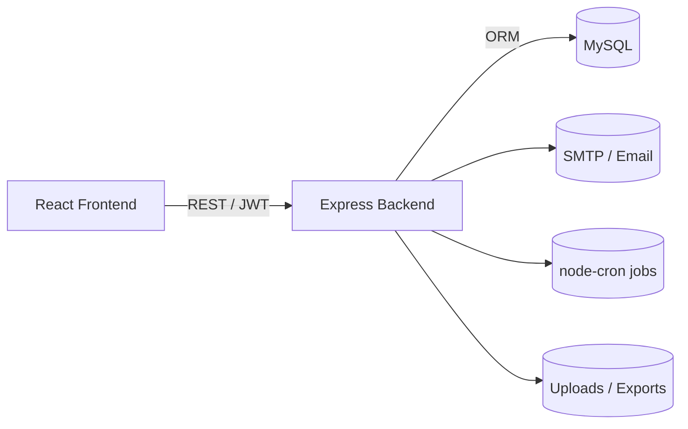
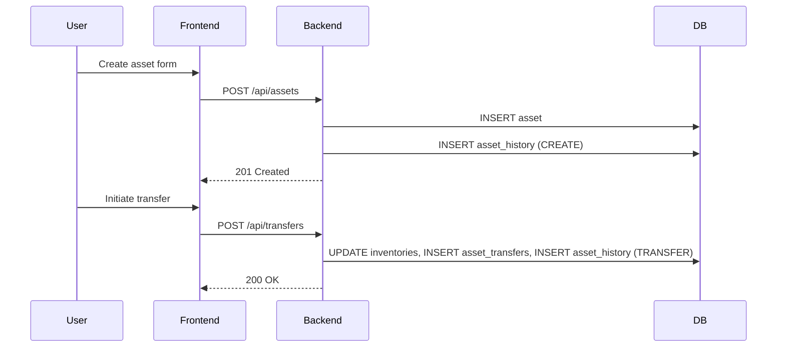

System Report Guide — Project IMS
=================================

Purpose
-------
This README-style guide is a detailed blueprint you can use to create a professional report (Word or PDF) for the Asset Management System (Project IMS). It describes architecture, technologies, data model, API surface, security, data flows, deployment, testing and presentation assets (diagrams, flowcharts, tables). Use the sections as report chapters and copy/expand them into a Word document.

Table of contents
-----------------
- Executive summary
- Technology stack
- Architecture and components
- Data model and database tables (summary)
- API surface and routes discovery
- Backend: controllers & business logic
- Frontend: pages, components and user flows
- Authentication, authorization, roles and access control
- Import / Export and backup flows
- Jobs, notifications and integrations
- Deployment & environment
- Security checklist
- Testing & QA
- Diagrams & presentation assets
- Recommendations and next steps

Executive summary
-----------------
Briefly: Project IMS is a Node.js + Express backend with Sequelize for ORM, MySQL as the persistent store, and a React frontend. The system manages assets across branches and service stations, supporting CRUD, transfers, maintenance logs, imports/exports, notifications, and support/requests.

Technology stack
----------------
- Backend
  - Node.js (LTS), Express framework
  - Sequelize ORM with `mysql2` driver
  - Authentication: JWT (`jsonwebtoken`) + password hashing with `bcryptjs`
  - File uploads: `multer`
  - Scheduling: `node-cron`
  - Mail: `nodemailer`
  - Security: `helmet`, `express-rate-limit`
- Frontend
  - React 18 (create-react-app/react-scripts)
  - React Router v6, axios for HTTP
  - UI: Tailwind CSS, `react-select`, `react-toastify`
  - Charts: Chart.js / Recharts
  - Excel import/export: `xlsx`
- Dev & infra
  - MySQL (XAMPP for local), phpMyAdmin optional
  - Deployment: Node hosting (PM2), MySQL server, optional Nginx reverse proxy

Architecture and components
---------------------------
High-level: React app (browser) <--> Express API (REST) <--> MySQL DB. Background jobs run in the Node process (cron). Email uses SMTP.

Mermaid: System overview

Data model and database tables (summary)
---------------------------------------
The schema is implemented with Sequelize models. Key domains:
- Users & Auth: `users` table (role enum `admin|subadmin|user`, `service_station_id`)
- Organization: `branches`, `service_stations`, `departments`, `employees`
- Asset domain: `asset_groups`, `asset_sub_categories`, `asset_transfers`, `asset_history`, `asset_maintenance_logs`, `asset_tracking_profiles`, `asset_live_status`, `asset_presence_logs`
- Branch inventories: many `branch_*` tables (`branch_desktops`, `branch_laptops`, `branch_printers`, `branch_scanners`, `branch_cctv`, `branch_ups`, `branch_connectivity`, `branch_networks`, `branch_application_software`, etc.)
- Support & Requests: `support_tickets`, `support_replies`, `requests`, `notifications`

Include a CREATE TABLE dump (auto-generated from models/migrations) in the appendix of the report. The schema is normalized for lookups and denormalized for branch-specific inventories.

API surface and routes discovery
--------------------------------
- Routes are registered in `backend/routes/*.js` and handled by `backend/controllers/*.js`.
- Common route groups to list in the report:
  - `/api/auth` — login, register, password reset
  - `/api/users` — user management
  - `/api/branches` — branch CRUD
  - `/api/assets` — asset CRUD, metadata
  - `/api/transfers` — asset transfers
  - `/api/maintenance` — maintenance tickets/logs
  - `/api/import` — import endpoints
  - `/api/export` — export endpoints
  - `/api/requests`, `/api/support`, `/api/notifications`

To extract exact endpoints (method + path + controller method), list files in `backend/routes/` and open each route file. For the report, create a table with columns: HTTP Method | Path | Controller | Auth required | Role(s).

Backend: controllers & business logic
-------------------------------------
Explain responsibilities for each controller and notable flows:
- `authController.js` — login issues JWT, `register` creates user hashed password, `reset` issues OTP or reset token
- `assetController.js` — create/update assets, link to branch tables, maintain `asset_history` entries when assets change
- `assetTransferController.js` — validate source/destination, update branch inventories and create `asset_transfers` record, add `asset_history`
- `assetMaintenanceController.js` — create maintenance tickets, update `asset_maintenance_logs`, calculate downtime and costs
- `assetImportController.js` — parse uploaded Excel/CSV, validate rows, create assets/users and return a summary with errors
- `notificationController.js` — create notifications and persist to `notifications` table; send emails for certain types

For each controller, include:
- Input payload example (JSON)
- Success and error responses
- Important validations and side-effects (e.g., history creation, notifications, inventory updates)

Frontend: pages, components and user flows
-----------------------------------------
List pages and flows to include in the report:
- Authentication: Login, Forgot password
- Dashboard: KPIs, charts (asset counts, maintenance status, branches)
- Assets: List, filters (by branch, type, status), create/edit modal, bulk import/export
- Asset details: history timeline, maintenance logs, transfers
- Branch management: CRUD, connectivity map
- Requests & Support: create request, request lifecycle, ticket conversation UI
- Employee management: list, import, link assets to employee

Component examples to mention: `AddAssetModal.jsx`, table components, file upload handlers, chart components.

Authentication, authorization, roles and access control
-------------------------------------------------------
- Authentication: JWT-based. Login endpoint returns token; frontend stores token (localStorage or secure cookie) and attaches `Authorization: Bearer <token>` header.
- Authorization: `role` stored in `users` (`admin`, `subadmin`, `user`). Middleware (`authMiddleware.js`, `roleMiddleware.js`, `adminMiddleware.js`) guards endpoints.
- Recommendations for report: mention where tokens are validated, how to revoke tokens (if implemented or not), and where session expiration is enforced.

Import / Export and backup flows
--------------------------------
- Imports:
  - Frontend reads Excel using `xlsx` and may POST file to backend for server-side parsing, or send parsed JSON.
  - Backend validates rows, skips/flags invalid rows, creates records, returns results summary.
- Exports:
  - Backend endpoints can export CSV/XLSX by streaming query results.
  - Frontend triggers download and uses `xlsx` to generate client-side exports where implemented.
- Backups:
  - If `backupController.js` exists, detail whether backups are DB dumps, file backups or storage to remote services; include how to restore backups.

Jobs, notifications and integrations
-----------------------------------
- Scheduled jobs: `node-cron` tasks for expiry notifications, cleanup, reminder emails.
- Notifications: stored in `notifications` table, optionally emailed via `nodemailer`.
- External integrations: SMTP for mail; potential integrations with monitoring or external asset tracking tools if present.

Deployment & environment
------------------------
- Environment variables in `backend/config/environment.js` and `.env`:
  - `DB_HOST`, `DB_PORT`, `DB_NAME`, `DB_USER`, `DB_PASSWORD`, `JWT_SECRET`, `PORT`, `API_URL`
- Recommend production process:
  - Use PM2 or systemd to run Node process
  - Use Nginx as reverse-proxy with HTTPS/TLS
  - Use managed MySQL or secure MySQL instance (do not use root; create dedicated DB user)
  - Backups: automated scheduled DB dumps to secure storage

Security checklist
------------------
- Use HTTPS in production (TLS termination at reverse proxy)
- Use strong `JWT_SECRET` and shorten token lifetime
- Store refresh tokens securely (if implemented)
- Ensure passwords hashed with bcrypt and enforce password complexity
- Use parameterized queries via Sequelize — avoid raw SQL where possible
- Rate-limit authentication endpoints (already using `express-rate-limit`)
- Sanitize/validate all uploaded files; restrict MIME types and size
- Secure file storage and access permissions for uploaded assets

Testing & QA
------------
- Unit tests: for utility functions and controllers (recommend `jest`)
- Integration tests: end-to-end tests using `supertest` for API
- E2E tests: Playwright or Cypress for frontend flows (login, create asset, transfer)
- Manual QA checklist: create assets, transfer, import invalid rows, test notifications, check role-based access

Diagrams & presentation assets
------------------------------
Include the following artifacts in your Word report (either as embedded Mermaid images or rendered PNGs):
- System architecture diagram (frontend, backend, DB, integrations)
- Auth sequence diagram (login → token → access)
- Asset lifecycle flow: creation → transfer → maintenance → retirement
- Database ER diagram (tables and key relationships) — generate via schema dump or DB reverse-engineer tool
- Sample UI screenshots: dashboard, asset detail, import flow

Mermaid examples (copy into Mermaid live editor for PNGs):

Asset lifecycle

Database ER guidance
--------------------
- Use an ER tool (MySQL Workbench, DBeaver) to reverse-engineer the DB into a relationship diagram. Include tables: `users`, `branches`, `service_stations`, `assets` (or `asset_*` tables), `asset_transfers`, `asset_history`, `asset_maintenance_logs`, `notifications`.

Recommendations and next steps
------------------------------
- Generate a full API endpoint list (Method | Path | Controller | Auth | Roles) and include as an appendix.
- Generate a full CREATE TABLE SQL dump and include as an appendix.
- Render Mermaid diagrams to PNG and add to the Word document for presentation clarity.
- Add seed data and a reproducible local setup script for demos (admin user, sample branches, sample assets).
- Consider an OpenAPI/Swagger spec for the API to aid documentation and tests.

How to use this guide to produce a Word or PowerPoint report
----------------------------------------------------------
1. Copy each heading from this file to your Word document as report sections.
2. Render Mermaid diagrams to PNG using the Mermaid Live Editor and insert images into the report.
3. Add screenshots of the UI from `frontend/public` or by running the frontend locally and taking screenshots.
4. Append the full SQL schema and an endpoint table into the appendix.
5. Proofread and add organization-specific context (branding, numbers, timelines) before presenting.

File locations to inspect while writing the report
-------------------------------------------------
- `backend/` — `server.js`, `app.js`, `config/`, `controllers/`, `models/`, `routes/`, `migrations/`, `jobs/`, `middleware/`
- `frontend/` — `src/components/`, `src/pages/`, `src/services/` (API helpers), `package.json`

Contact me with any sections you want expanded or if you want me to extract the full endpoint list and a complete CREATE TABLE SQL dump and attach them into a single Word file.
